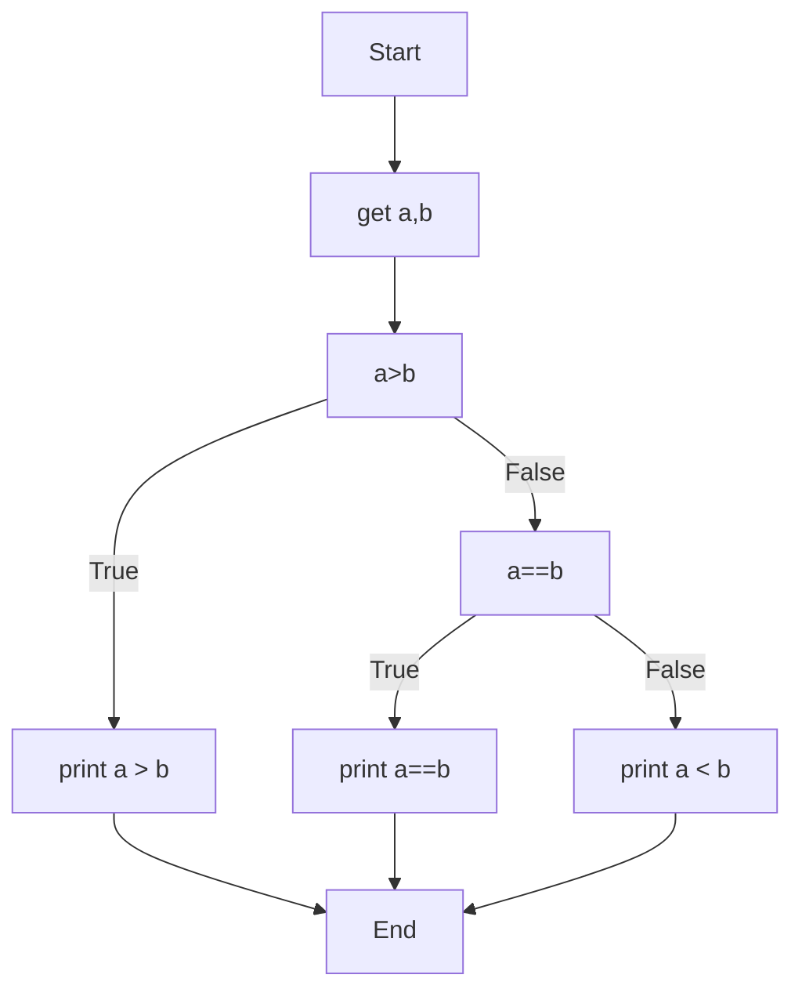

```mermaid
graph TD
    A[Start] --> B[get a,b]
    B --> C[a>b]
    C -->|True| I[print a > b]
    C -->|False| D[a==b]
    D --> |True| F[print a==b]
    D -->|False| H[print a < b]
    I --> G[End]
    F --> G
    H --> G
```