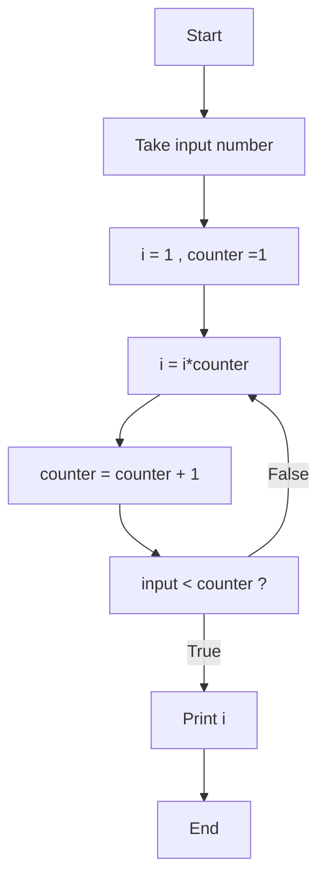

```mermaid
graph TD
    A[Start] --> B[Take input number]
    B --> C[i = 1 , counter =1]
    C --> D[i = i*counter]
    D --> F[counter = counter + 1]
    F --> G[input < counter ?]
    G --> |True| L[Print i]
    G --> |False| D
    L --> J[End]
```
