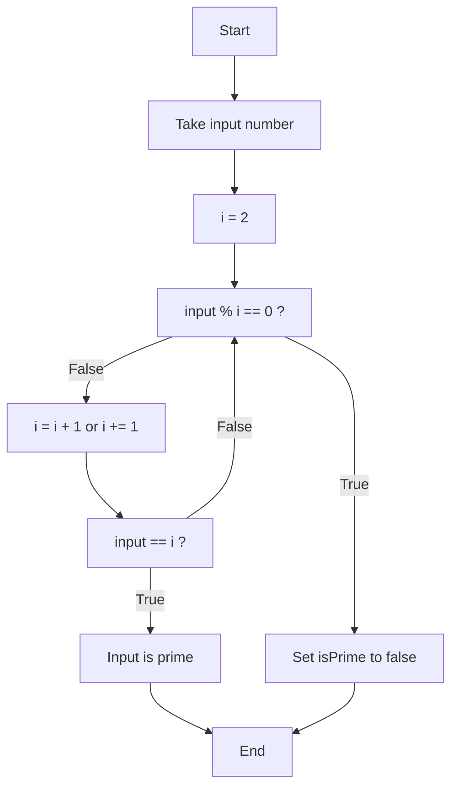

```mermaid
graph TD
    A[Start] --> B[Take input number]
    B --> C[i = 2]
    C --> D[input % i == 0 ?]
    D -->|True| I[Set isPrime to false]
    D -->|False| F[i = i + 1 or i += 1]
    F --> G[input == i ?]
    G -->|True| L[Input is prime]
    G --> |False| D
    L --> J
    I --> J[End]
```