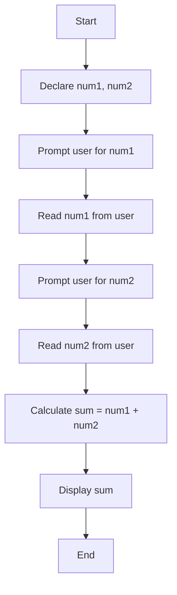

```mermaid
graph TD
    A[Start] --> B[Declare num1, num2]
    B --> C[Prompt user for num1]
    C --> D[Read num1 from user]
    D --> E[Prompt user for num2]
    E --> F[Read num2 from user]
    F --> G[Calculate sum = num1 + num2]
    G --> H[Display sum]
    H --> I[End]

```