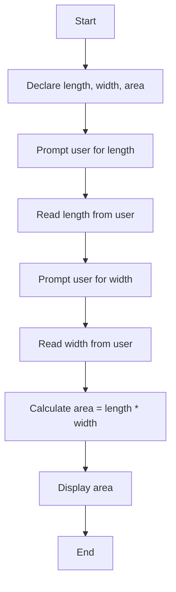

```mermaid
graph TD
    A[Start] --> B[Declare length, width, area]
    B --> C[Prompt user for length]
    C --> D[Read length from user]
    D --> E[Prompt user for width]
    E --> F[Read width from user]
    F --> G[Calculate area = length * width]
    G --> H[Display area]
    H --> I[End]


```