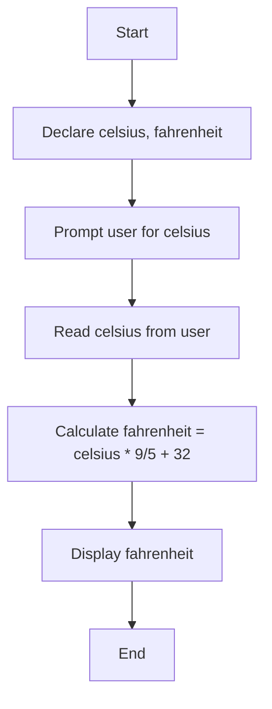

```mermaid
graph TD
    A[Start] --> B[Declare celsius, fahrenheit]
    B --> C[Prompt user for celsius]
    C --> D[Read celsius from user]
    D --> E[Calculate fahrenheit = celsius * 9/5 + 32]
    E --> F[Display fahrenheit]
    F --> G[End]
```