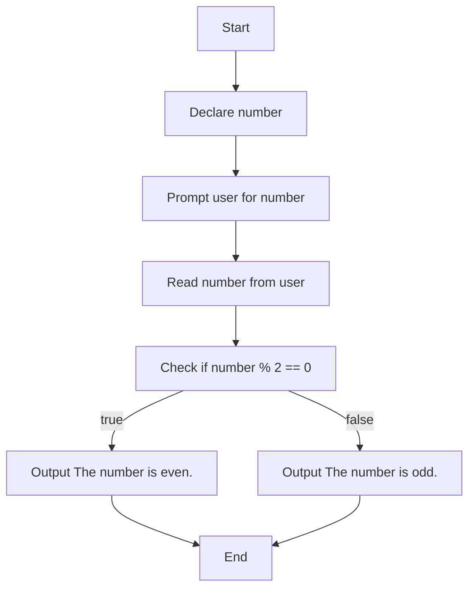

```mermaid
graph TD
    A[Start] --> B[Declare number]
    B --> C[Prompt user for number]
    C --> D[Read number from user]
    D --> E[Check if number % 2 == 0]
    E -->|true| F[Output The number is even.]
    E -->|false| G[Output The number is odd.]
    F --> H[End]
    G --> H[End]


```