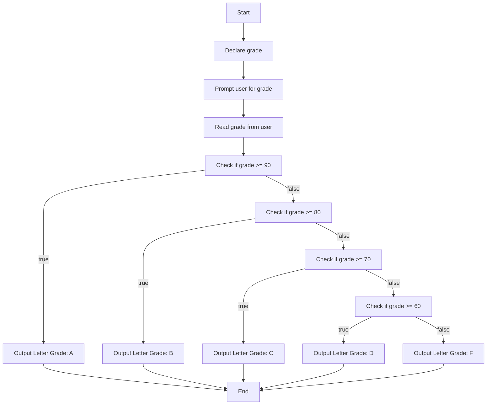

```mermaid
graph TD
    A[Start] --> B[Declare grade]
    B --> C[Prompt user for grade]
    C --> D[Read grade from user]
    D --> E[Check if grade >= 90]
    E -->|true| F[Output Letter Grade: A]
    E -->|false| G[Check if grade >= 80]
    G -->|true| H[Output Letter Grade: B]
    G -->|false| I[Check if grade >= 70]
    I -->|true| J[Output Letter Grade: C]
    I -->|false| K[Check if grade >= 60]
    K -->|true| L[Output Letter Grade: D]
    K -->|false| M[Output Letter Grade: F]
    F --> N[End]
    H --> N[End]
    J --> N[End]
    L --> N[End]
    M --> N[End]

```