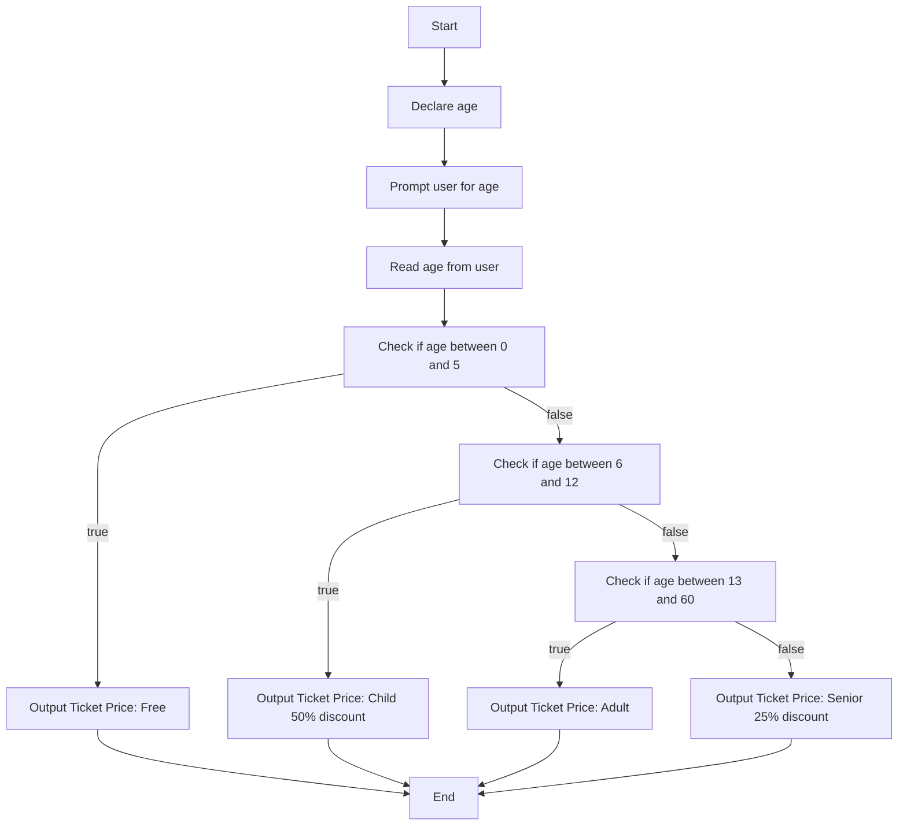

```mermaid
graph TD
    A[Start] --> B[Declare age]
    B --> C[Prompt user for age]
    C --> D[Read age from user]
    D --> E[Check if age between 0 and 5]
    E -->|true| F[Output Ticket Price: Free]
    E -->|false| G[Check if age between 6 and 12]
    G -->|true| H[Output Ticket Price: Child 50% discount]
    G -->|false| I[Check if age between 13 and 60]
    I -->|true| J[Output Ticket Price: Adult]
    I -->|false| K[Output Ticket Price: Senior 25% discount]
    F --> L[End]
    H --> L[End]
    J --> L[End]
    K --> L[End]


```