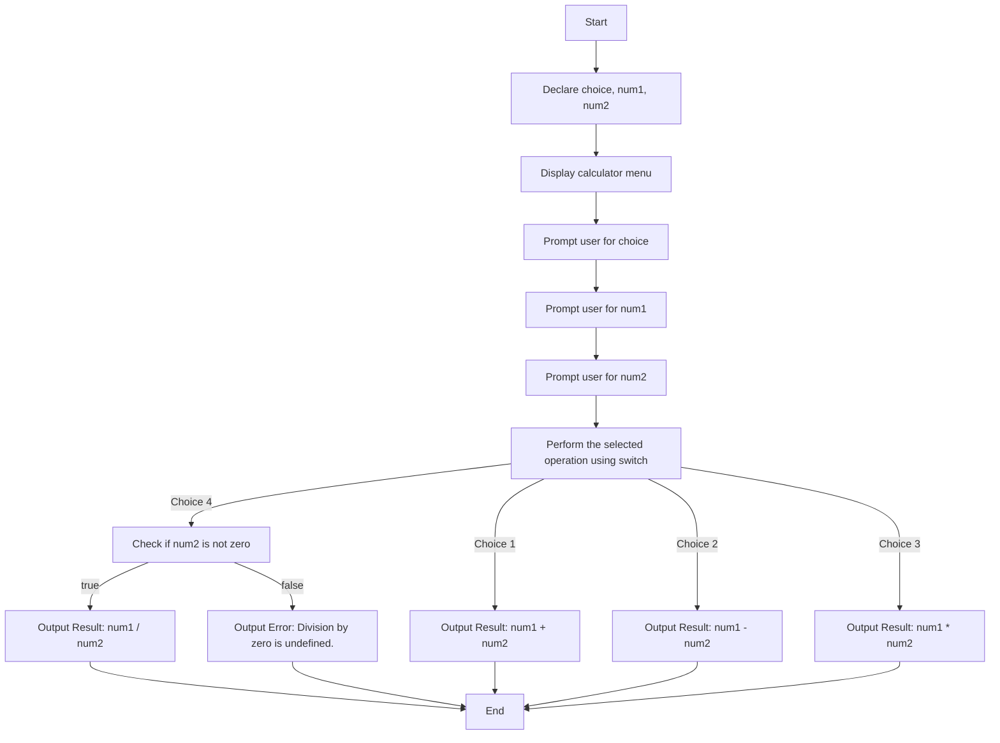

```mermaid
graph TD
    A[Start] --> B[Declare choice, num1, num2]
    B --> C[Display calculator menu]
    C --> D[Prompt user for choice]
    D --> E[Prompt user for num1]
    E --> F[Prompt user for num2]
    F --> G[Perform the selected operation using switch]
    G -->|Choice 1| H[Output Result: num1 + num2]
    G -->|Choice 2| I[Output Result: num1 - num2]
    G -->|Choice 3| J[Output Result: num1 * num2]
    G -->|Choice 4| K[Check if num2 is not zero]
    K -->|true| L[Output Result: num1 / num2]
    K -->|false| M[Output Error: Division by zero is undefined.]
    L --> N[End]
    M --> N[End]
    H --> N[End]
    I --> N[End]
    J --> N[End]

```