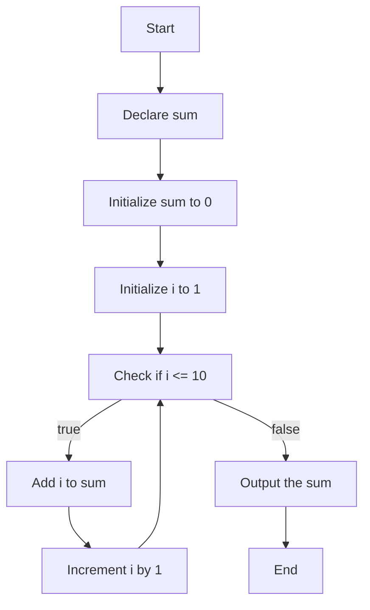

```mermaid
graph TD
    A[Start] --> B[Declare sum]
    B --> C[Initialize sum to 0]
    C --> D[Initialize i to 1]
    D --> E[Check if i <= 10]
    E -->|true| F[Add i to sum]
    F --> G[Increment i by 1]
    G --> E
    E -->|false| H[Output the sum]
    H --> I[End]
```