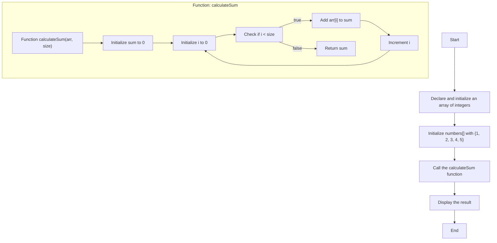

```mermaid
graph TD
    A[Start] --> B[Declare and initialize an array of integers]
    B --> C["Initialize numbers[] with {1, 2, 3, 4, 5}"]
    C --> D[Call the calculateSum function]
    D --> E[Display the result]
    E --> I[End]

    subgraph Function: calculateSum
        F["Function calculateSum(arr, size)"]
        F --> G[Initialize sum to 0]
        G --> H[Initialize i to 0]
        H --> J[Check if i < size]
        J -->|true| K["Add arr[i] to sum"]
        K --> L[Increment i]
        L --> H
        J -->|false| M[Return sum]
    end
```