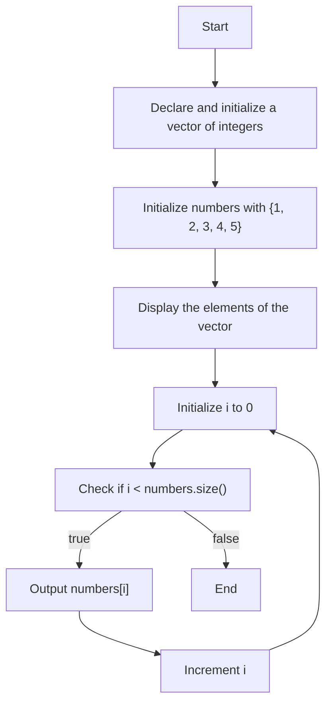

```mermaid
graph TD
    A[Start] --> B[Declare and initialize a vector of integers]
    B --> C["Initialize numbers with {1, 2, 3, 4, 5}"]
    C --> D[Display the elements of the vector]
    D --> E[Initialize i to 0]
    E --> F["Check if i < numbers.size()"]
    F -->|true| G["Output numbers[i]"]
    G --> H[Increment i]
    H --> E
    F -->|false| I[End]
```