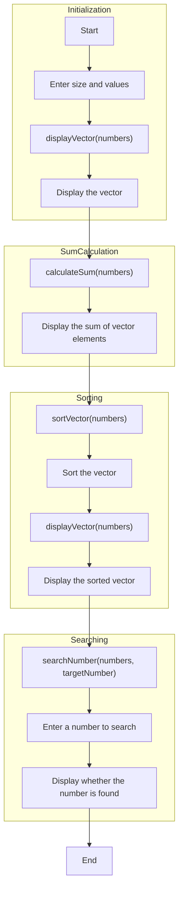

```mermaid
flowchart TD
    subgraph Initialization
        A[Start] --> B[Enter size and values]
        B --> C["displayVector(numbers)"]
        C --> D[Display the vector]
    end

    subgraph SumCalculation
        D --> E["calculateSum(numbers)"]
        E --> F[Display the sum of vector elements]
    end

    subgraph Sorting
        F --> G["sortVector(numbers)"]
        G --> H[Sort the vector]
        H --> I["displayVector(numbers)"]
        I --> J[Display the sorted vector]
    end

    subgraph Searching
        J --> K["searchNumber(numbers, targetNumber)"]
        K --> L[Enter a number to search]
        L --> M[Display whether the number is found]
    end

    M --> N[End]
```